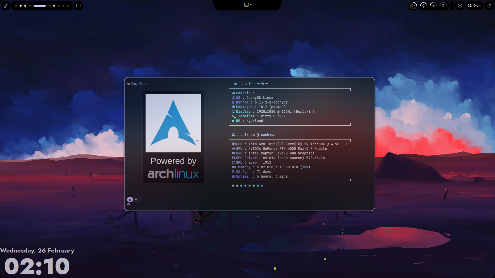
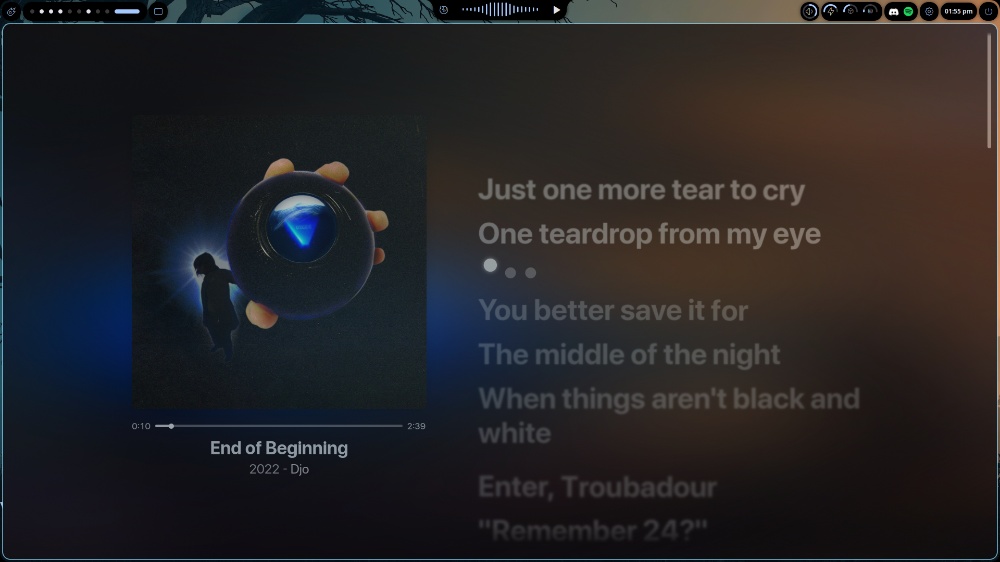
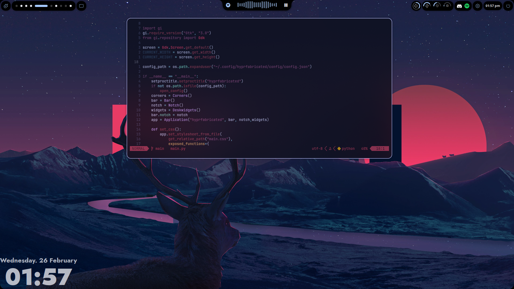
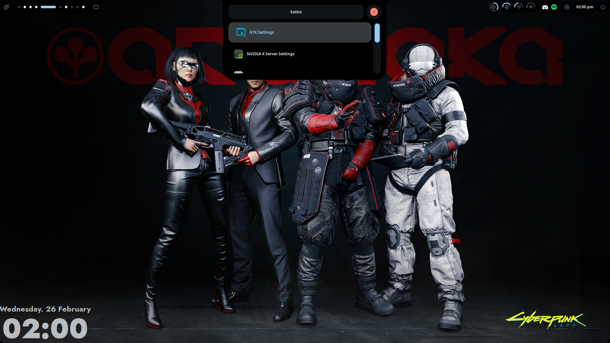
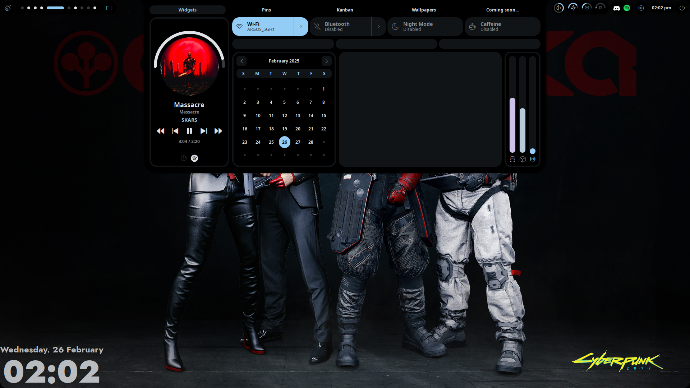

<h1 align="center"><b>HYPRFABRICATED</b></h1>

<div align="center">

[](https://github.com/tr1xem/hyprfabricated/stargazers)
[](https://hyprland.org/)
[]()
[](https://discord.gg/EMWUTgegDm)

</div>
<p align="center"> <sup>A ʜᴀᴄᴋᴀʙʟᴇ sʜᴇʟʟ ꜰᴏʀ Hʏᴘʀʟᴀɴᴅ, ᴘᴏᴡᴇʀᴇᴅ ʙʏ <a href="https://github.com/Fabric-Development/fabric/">Fᴀʙʀɪᴄ</a>. </sup></p>

<h2><sub></sub> Screenshots</h2>
<table align="center">
  <tr>
    <td colspan="4"></td>
  </tr>
  <tr>
    <td colspan="1"></td>
    <td colspan="1"></td>
    <td colspan="1" align="center"></td>
    <td colspan="1" align="center"></td>
  </tr>
</table>

<h2><sub></sub> Installation</h2>

> [!NOTE]
>
> - You need a functioning Hyprland installation. <br>
> - You need to install plasma-browser-integration for mpris and cava to work as it is intended <br>
> - Join the discord server for better support

### Arch Linux

> [!TIP]
>
> - This command also works for updating an existing installation!!! <br>
> - If you see a transparent bar just change the wallpaper from notch > wallpaper as then it would gen color configs

```bash
curl -fsSL https://raw.githubusercontent.com/tr1xem/hyprfabricated/main/install.sh | bash
```

### Manual Installation
1. Install dependencies:

- Aur/Pacman:
  - [`Fabric`](https://github.com/Fabric-Development/fabric)
  - [`fabric-cli`](https://github.com/Fabric-Development/fabric-cli)
  - [`Gray`](https://github.com/Fabric-Development/gray)
  - [`Matugen`](https://github.com/InioX/matugen)
  - [`acpi`](https://github.com/acpica/acpica)
  - [`brightnessctl`](https://github.com/Hummer12007/brightnessctl)
  - [`cava`](https://github.com/karlstav/cava)
  - [`gnome-bluetooth-3.0`](https://github.com/GNOME/gnome-bluetooth)
  - [`gpu-screen-recorder`](https://git.dec05eba.com/gpu-screen-recorder/)
  - [`grimblast`](https://github.com/hyprwm/contrib/tree/main/grimblast)
  - [`hypridle`](https://github.com/hyprwm/hypridle)
  - [`hyprlock`](https://github.com/hyprwm/hyprlock)
  - [`hyprpicker`](https://github.com/hyprwm/hyprpicker)
  - [`hyprsunset`](https://github.com/hyprwm/hyprsunset)
  - [`imagemagick`](https://github.com/ImageMagick/ImageMagick)
  - [`libnotify`](https://github.com/GNOME/libnotify)
  - [`noto-fonts-emoji`](https://github.com/androlabs/emoji-archlinux)
  - [`playerctl`](https://github.com/altdesktop/playerctl)
  - [`swappy`](https://github.com/jtheoof/swappy)
  - [`swww`](https://github.com/LGFae/swww)
  - [`tesseract`](https://github.com/tesseract-ocr/tesseract)
  - [`uwsm`](https://github.com/Vladimir-csp/uwsm)
  - [`cantarell-fonts-0.100`](https://fonts.google.com/specimen/Cantarell)
  - [`wl-clipboard`](https://github.com/bugaevc/wl-clipboard)
  - [`wlinhibit`](https://github.com/0x5a4/wlinhibit)
  - [`grimblast-git`](https://github.com/hyprwm/contrib/blob/main/grimblast/grimblast)
  - [`tmux`](https://github.com/tmux/tmux/wiki)
- Python dependencies:
  - [ijson](https://pypi.org/project/ijson/)
  - [pillow](https://pypi.org/project/pillow/)
  - [psutil](https://pypi.org/project/psutil/)
  - [requests](https://pypi.org/project/requests/)
  - [setproctitle](https://pypi.org/project/setproctitle/)
  - [toml](https://pypi.org/project/toml/)
  - [watchdog](https://pypi.org/project/watchdog/)
- Fonts (automated on first run):
  - [Zed Sans](https://github.com/zed-industries/zed-fonts)
  - [Tabler Icons](https://tabler.io/icons)

3. Download and run Ax-Shell:
   ```bash
   git clone https://github.com/tr1xem/hyprfabricated.git ~/.config/hyprfabricated
   uwsm -- app python ~/.config/hyprfabricated/main.py > /dev/null 2>&1 & disown
   ```

<h2><sub></sub> Roadmap</h2>

- [x] App Launcher
- [x] Bluetooth Manager
- [x] Calculator
- [x] Calendar
- [x] Color Picker
- [x] Customizable UI
- [x] Dashboard
- [x] Dock
- [x] Emoji Picker
- [x] Kanban Board
- [x] Notifications
- [x] OCR
- [x] Full Gui Config
- [x] Better Desktop Widgets
- [x] Customizable Widgets and Bar
- [x] Gui Updater and update notifier
- [x] Pins
- [x] Power Manager
- [x] Power Menu
- [x] Screen Recorder
- [x] Screenshot
- [x] Settings
- [x] System Tray
- [x] Terminal
- [x] Tmux Session Manager
- [x] Vertical Layout
- [x] Wallpaper Selector
- [x] Workspaces Overview
- [ ] Clipboard Manager
- [ ] Multi-monitor support
- [ ] Multimodal AI Assistant
- [ ] Network Manager
- [ ] OTP Manager

# Contibutors
<a href="https://github.com/tr1xem/hyprfabricated/graphs/contributors">
  
</a>

## Star History

[](https://star-history.com/#tr1xem/hyprfabricated&Date)


